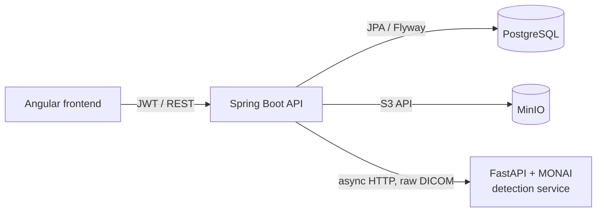

# 🩻 Medical Imaging Backend

> REST API of the **AI-Powered Medical Imaging Analysis & Automated Radiology Reporting Platform** — built during my AI Engineering internship at **XeleronAI Ltd** (London, remote).


Frontend: [medical-imaging-frontend](https://github.com/ahmedaminefaiz/medical-imaging-frontend)

---

## ✨ Features

- 🔐 **JWT authentication** with role-based access control and **login rate limiting** (Bucket4j)
- 📤 **Exam upload** — standard images (PNG/JPEG) or **DICOM** series (single files or whole folders)
- 🧾 **DICOM metadata extraction** (patient, study, body part) and **DICOM → PNG preview** conversion with dcm4che (incl. RLE codec)
- 👤 Patient find-or-create by **MRN**, paginated exam list with search
- 🗄️ Object storage on **MinIO**, with compensation on failed uploads; files are only served through the backend (no storage keys exposed)
- 🤖 **Asynchronous AI detection** — the backend sends the raw DICOM series to a Python/MONAI detection service and stores the bounding boxes
- ✅ **Clinician-in-the-loop** — every detection starts as `EN_ATTENTE` and must be accepted or rejected by a clinician
- 📜 **Audit log** for sensitive actions (upload, image view, …)
- 🧪 Unit & slice tests (services, repositories, security, controllers)

## 🏗️ Architecture



**Layers:** `controller` → `service` (interfaces + `impl`) → `repository`, with DTOs per domain (`dto/examen`, `dto/detection`, …) mapped by **MapStruct**.

**Data model:** `utilisateur`, `patient`, `examen`, `image`, `detection`, `audit_log` — versioned with **Flyway** migrations (`V1` → `V9`).

## 🧰 Tech stack

Spring Web MVC · Spring Security · Spring Data JPA · Validation · Flyway · PostgreSQL · JJWT · Bucket4j · MinIO SDK · dcm4che · MapStruct · Lombok · Swagger annotations · JUnit

## ▶️ Run locally

**Prerequisites:** Java 21, Docker

```bash
# 1. Start PostgreSQL and MinIO
docker run -d --name medimg-pg -e POSTGRES_DB=medimg -e POSTGRES_PASSWORD=postgres -p 5432:5432 postgres:16
docker run -d --name medimg-minio -p 9000:9000 -p 9001:9001 minio/minio server /data --console-address ":9001"

# 2. Configure src/main/resources/application.properties (DB, MinIO, JWT secret, AI service URL)

# 3. Run the API
./mvnw spring-boot:run

# Tests
./mvnw test
```

## 🗺️ Roadmap

- [x] Sprint 1 — architecture, auth, image management (upload / storage / review, DICOM)
- [x] Sprint 2 — AI detection pipeline (async, pre-trained MONAI model)
- [ ] Detection validation UI & workflow
- [ ] Automated structured radiology report generation

---

👤 **Ahmed Amine Faiz** — AI Engineering student @ ENIAD Berkane · [GitHub](https://github.com/ahmedaminefaiz)
