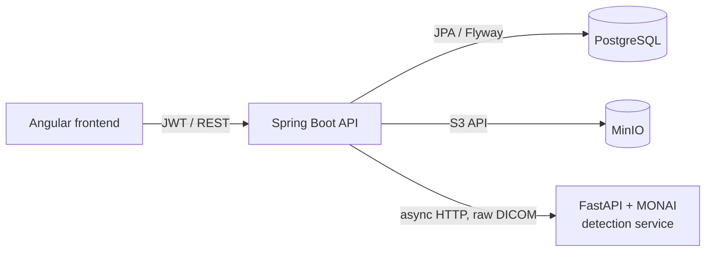

# 🩻 Medical Imaging Backend

> REST API of the **AI-Powered Medical Imaging Analysis & Automated Radiology Reporting Platform** — built during my AI Engineering internship at **XeleronAI Ltd** (London, remote).


Frontend: [medical-imaging-frontend](https://github.com/ahmedaminefaiz/medical-imaging-frontend)

---

## ✨ Features

- 🔐 **JWT authentication** with role-based access control and **login rate limiting** (Bucket4j)
- 📤 **Exam upload** — standard images (PNG/JPEG) or **DICOM** series (single files or whole folders)
- 🧾 **DICOM metadata extraction** (patient, study, body part) and **DICOM → PNG preview** conversion with dcm4che (incl. RLE codec)
- 👤 Patient find-or-create by **MRN**, paginated exam list with search
- 🗄️ Object storage on **MinIO**, with compensation on failed uploads; files are only served through the backend (no storage keys exposed)
- 🤖 **Asynchronous AI analysis** — the backend sends the raw DICOM series to a Python/MONAI service and stores either **bounding boxes** (detection) or **segmentation masks** (see [AI integration](#-ai-integration))
- ✅ **Clinician-in-the-loop validation** — every AI result starts as `EN_ATTENTE`; a radiologist accepts or rejects it, with traceability (validator + timestamp)
- 📜 **Audit log** for sensitive actions, with action names centralized in `AuditActionEnum`
- 🧪 Unit & slice tests (services, repositories, security, controllers)

## 🏗️ Architecture



**Layers:** `controller` → `service` (interfaces + `impl`) → `repository`, with DTOs per domain (`dto/examen`, `dto/detection`, …) mapped by **MapStruct**.

**Data model:** `utilisateur`, `patient`, `examen`, `image`, `detection`, `audit_log` — versioned with **10 Flyway migrations** (`V1` → `V10`, in `src/main/resources/db/migration`).

## 🤖 AI integration

Analysis is triggered with `POST /api/v1/examens/{examenId}/detections/analyser` (roles `RADIOLOGUE`, `TECHNICIEN`) and returns **202 Accepted** immediately. `DetectionAnalyseServiceImpl.analyserEnArrierePlan` runs on a dedicated executor (`@Async("detectionTaskExecutor")`): it reads the series from MinIO and calls the AI service through `DetectionAiClient` (`POST /predict`). Progress is polled with `GET …/detections/statut` (`AnalyseStatutEnum` on the exam).

The AI response carries a `type` (`BOX` or `MASQUE`, never both in one response). The backend stores both kinds of results in the same `Detection` entity, discriminated by its `type` field (`DetectionTypeEnum`):

| `type` | Produced by | What is stored |
|---|---|---|
| `BOX` | detection model | bbox coordinates in `x`, `y`, `largeur`, `hauteur` (+ `coupe`, `anomalie`, `confiance`) |
| `MASQUE` | segmentation model | the PNG mask is decoded and uploaded to **MinIO** under a random key (`examens/{id}/masques/{UUID}.png`); only that key is persisted in `chemin_masque` |

The mask's storage key is **never exposed** to the client: `DetectionResponse` only exposes a boolean `apercuMasqueDisponible`, and the PNG is served by the gatekeeper endpoint `GET /api/v1/examens/{examenId}/detections/{detectionId}/masque` (each access is audited as `VIEW_MASQUE`).

## ✅ Detection validation

`PATCH /api/v1/examens/{examenId}/detections/{detectionId}/statut` with body `{ "statut": "ACCEPTEE" | "REJETEE" }`

- Restricted to radiologists: `@PreAuthorize("hasRole('RADIOLOGUE')")`
- AI results are created as `EN_ATTENTE`; the radiologist moves them to `ACCEPTEE` or `REJETEE` (`DetectionStatutEnum`). Any other value returns **400**.
- Traceability: the validator (`validateur_id`) and the timestamp (`valide_le`) are stored on the detection (migration `V10`).
- Each decision is written to the audit log as `DETECTION_VALIDATION`, along with the transition (e.g. `DETECTION_VALIDATION:EN_ATTENTE->ACCEPTEE`).

## 📜 Audit

Sensitive actions are recorded in `audit_log` (user, action, resource type/id, date). Action names are centralized in `AuditActionEnum`:

| Action | When |
|---|---|
| `UPLOAD_EXAMEN` | an exam is uploaded |
| `VIEW_IMAGE` | an image preview is viewed |
| `VIEW_MASQUE` | a segmentation mask is viewed |
| `ANALYSE_DEMANDEE` | an AI analysis is requested |
| `DETECTION_RUN` | an AI run finishes (success or failure) |
| `DETECTION_VALIDATION` | a radiologist accepts/rejects a detection |

## 🧰 Tech stack

Spring Web MVC · Spring Security · Spring Data JPA · Validation · Flyway · PostgreSQL · JJWT · Bucket4j · MinIO SDK · dcm4che · MapStruct · Lombok · Swagger annotations · JUnit

## ▶️ Run locally

**Prerequisites:** Java 21, Docker

```bash
# 1. Start PostgreSQL and MinIO
docker run -d --name medimg-pg -e POSTGRES_DB=medimg -e POSTGRES_PASSWORD=postgres -p 5432:5432 postgres:16
docker run -d --name medimg-minio -p 9000:9000 -p 9001:9001 minio/minio server /data --console-address ":9001"

# 2. Configure src/main/resources/application.properties (DB, MinIO, JWT secret, AI service URL)

# 3. Run the API
./mvnw spring-boot:run

# Tests
./mvnw test
```

## 🗺️ Roadmap

- [x] Sprint 1 — architecture, auth, image management (upload / storage / review, DICOM)
- [x] Sprint 2 — AI pipeline (async detection + segmentation, pre-trained MONAI models), clinician validation module, consolidated audit
- [ ] Automated structured radiology report generation

---

👤 **Ahmed Amine Faiz** — AI Engineering student @ ENIAD Berkane · [GitHub](https://github.com/ahmedaminefaiz)
